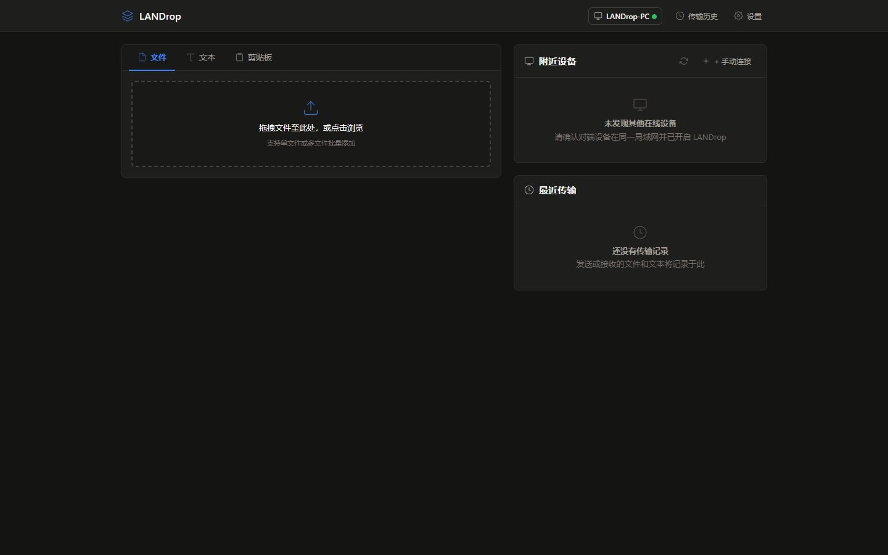
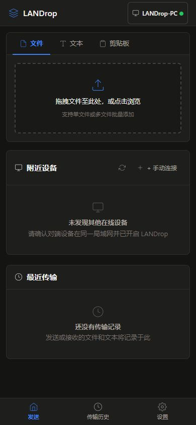

# LAN Drop — Local network file and text sharing

[简体中文](README.md) | [English](README.en.md)

LAN Drop is a Go-based tool for sharing files, text, and clipboard content between devices on the same network. It provides a shared web interface for desktop and mobile browsers, plus CLI commands for sending, receiving, device discovery, and transfer history. No cloud relay service is required.

[Download v2.0.0](https://github.com/rowanjove/LANDrop/releases/tag/v2.0.0) · [Release notes](docs/releases/v2.0.0.md) · [Report an issue](https://github.com/rowanjove/LANDrop/issues)

## Screenshots

Desktop:



Mobile:



## What's new in 2.0

- Rebuilt the web interface with Preact, TypeScript, and modular CSS for a shared desktop and mobile experience.
- Added a file queue that supports adding, removing, or clearing files before an upload starts.
- Added multi-file transfers with individual downloads and an optional ZIP download.
- Added a dedicated receive page for previewing, copying, and downloading files or text.
- Improved progress reporting, cancellation, expiry cleanup, resume support, and one-time token lifecycle handling.
- Persisted device name, theme, and language settings on the backend.
- Advertised the correct HTTP or HTTPS scheme through mDNS for device links and QR codes.
- Automatically opens the browser when `landrop.exe` or `landrop serve` starts; terminal output is now Chinese-first.

See the complete [v2.0.0 release notes](docs/releases/v2.0.0.md).

## Install and start sharing

Release archives are available for Windows amd64, macOS amd64/arm64, and Linux amd64/arm64. Download and extract the archive for your platform.

Windows:

```powershell
.\landrop.exe
```

macOS/Linux:

```bash
chmod +x landrop
./landrop
```

The application opens the local web page automatically and also prints the LAN address and QR code in the terminal. A phone on the same network can scan the QR code to connect. Allow necessary local-network firewall access and do not forward the service port to the public internet.

## Features

- Select or drag one or more files in the browser.
- Share text while preserving Unicode, emoji, code, and line breaks.
- Push and read plain-text clipboard content through the web UI.
- Discover devices on the LAN using mDNS or connect to an address manually.
- Protect access with a PIN, HTTPS/TLS, and one-time download links.
- Inspect transfer progress, status, and local history.
- Send, receive, and resume file downloads from the CLI.

## Common commands

```bash
landrop serve --port 53217
landrop send ./photo.jpg ./documents/
landrop send --text "hello from LAN Drop"
landrop recv . --target 192.168.1.10:53217
landrop recv . --continue --target 192.168.1.10:53217
landrop devices
landrop history --limit 20
```

Enable a PIN, TLS, or one-time downloads:

```bash
landrop serve --pin 5231 --tls --one-time
landrop recv . --pin 5231 --tls --target 192.168.1.10:53217
```

List all commands:

```bash
landrop --help
```

## One-time links and security boundaries

A one-time download token is consumed after a real download completes. Opening a preview, sending a HEAD request, or interrupting an incomplete download does not consume it early.

TLS encrypts transport between a client and the LAN Drop server. The current server generates a temporary self-signed certificate, which triggers browser trust warnings. Some CLI HTTPS requests skip certificate verification, so `--tls` alone does not establish full server identity verification or protection against an active man-in-the-middle attack.

Default commands do not automatically enable a PIN or TLS. Use a trusted LAN, enable protection as needed, and verify the target device. Do not expose LANDrop directly to the public internet.

## Build from source

Requirements: Go 1.25 and Node.js 18 or later.

```bash
git clone https://github.com/rowanjove/LANDrop.git
cd LANDrop/web
npm ci
npm run typecheck
npm run build
cd ..
go test ./...
go build -o landrop .
```

On Windows, replace the final command with:

```powershell
go build -o landrop.exe .
```

The frontend output is stored in `web/dist` and embedded into the release binary with `go:embed`; end users do not need Node.js.

## Documentation

- [Product requirements](docs/PRD.md)
- [Architecture](docs/ARCHITECTURE.md)
- [Implementation notes](docs/IMPLEMENTATION.md)
- [v2.0.0 release notes](docs/releases/v2.0.0.md)

## Contributing and license

When reporting an [issue](https://github.com/rowanjove/LANDrop/issues), include the operating system, version, send/receive method, network setup, and reproduction steps. Do not include private files or PINs. Run `go test ./...`, `npm run typecheck`, and `npm run build` before submitting code changes.

Licensed under the [MIT License](LICENSE).
