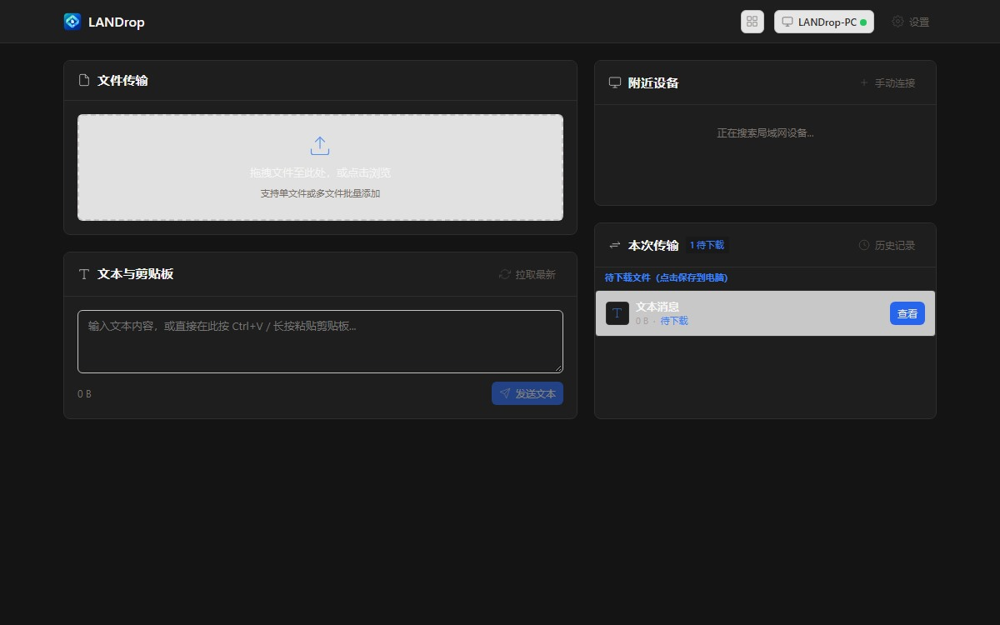
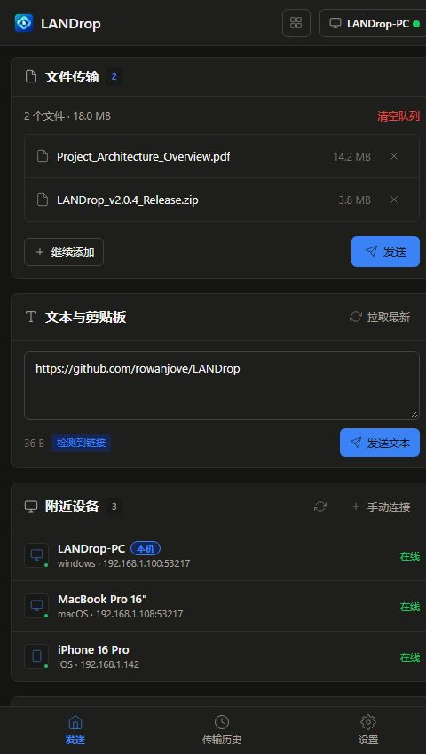

# LANDrop — 局域网文件与文本分享

[简体中文](README.md) | [English](README.en.md)

LANDrop 是一个轻量级局域网文件与文本快传工具，使用 Go 编写并内嵌响应式 Web 界面。只需在同一 Wi-Fi 或局域网下，即可在电脑、手机和平板之间传输文件、文本与剪贴板内容，免装客户端，无需公网中转。

[下载最新版本 (v2.0.3)](https://github.com/rowanjove/LANDrop/releases/tag/v2.0.3) · [更新说明](docs/releases/v2.0.3.md) · [提交反馈](https://github.com/rowanjove/LANDrop/issues)

## 界面截图

桌面端界面：



移动端界面：



## 主要特性

- **即开即用**：双击直接启动，自动拉起默认浏览器，同时在终端打印局域网访问地址和二维码。
- **免装客户端**：手机、平板自带浏览器扫码即可收发文件，支持移动端设备自动发现与在线状态感知。
- **发送队列与批量下载**：支持多文件拖拽加入队列，支持单文件逐个提取或按需自动打包 ZIP。
- **文本与剪贴板互通**：支持文本消息发送、剪贴板一键推送与同步，完整保留排版与换行。
- **安全与权限控制**：支持可选的 4 位动态 PIN 码验证、自签名 HTTPS/TLS 加密传输及一次性阅后即焚下载链接。
- **完整命令行支持**：除 Web 界面外，支持纯终端下的文件发送、接收、断点续传与设备探测。

## 快速使用

在 [GitHub Releases](https://github.com/rowanjove/LANDrop/releases/tag/v2.0.3) 下载对应操作系统的压缩包，解压后直接运行：

### Windows
双击 `landrop.exe`，或在命令行中运行：
```powershell
.\landrop.exe
```

### macOS / Linux
```bash
chmod +x landrop
./landrop
```

启动后控制台将显示本机 IP 地址及对应端口（默认 `53217`）。同一局域网下的其他设备打开浏览器访问该地址，或扫描终端二维码即可连接。

## 常用命令行示例

```bash
# 启动后台服务并自定义端口
landrop serve --port 53217

# 发送文件或目录至局域网
landrop send ./document.pdf ./photos/

# 发送纯文本消息
landrop send --text "局域网通知内容"

# 接收文件并保存至指定目录（自动连接目标节点）
landrop recv ./downloads --target 192.168.1.10:53217

# 断点续传未下载完成的大文件
landrop recv ./downloads --continue --target 192.168.1.10:53217

# 启用 4 位数字 PIN 码与 TLS 加密保护
landrop serve --pin 8848 --tls --one-time

# 扫描并查看局域网内当前在线设备
landrop devices

# 查看最近传输历史记录
landrop history --limit 20
```

## 从源码构建

环境要求：Go 1.22+，Node.js 18+。

```bash
# 克隆仓库
git clone https://github.com/rowanjove/LANDrop.git
cd LANDrop

# 构建前端产物
cd web
npm ci
npm run build
cd ..

# 编译主程序（内嵌前端静态文件）
go test ./...
go build -ldflags "-s -w" -o landrop .
```

Windows 环境输出：
```powershell
go build -ldflags "-s -w" -o landrop.exe .
```

## 相关文档

- [系统架构设计](docs/ARCHITECTURE.md)
- [v2.0.3 更新日志](docs/releases/v2.0.3.md)
- [v2.0.2 更新日志](docs/releases/v2.0.2.md)
- [v2.0.1 更新日志](docs/releases/v2.0.1.md)
- [v2.0.0 更新日志](docs/releases/v2.0.0.md)

## 开源协议

本项目基于 [MIT License](LICENSE) 许可协议开放。
