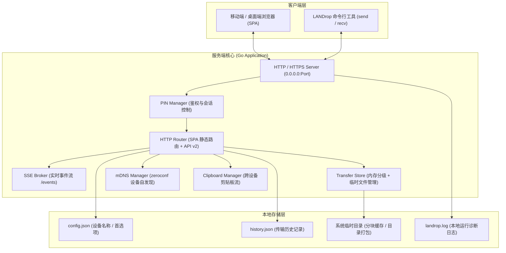

# LANDrop 系统架构设计

本文档介绍 LANDrop 2.0+ 的系统架构设计、核心模块划分、网络协议及安全控制机制。

---

## 1. 总体设计原则

- **即开即用，零配置**：单个可执行文件，内嵌响应式 Web 界面与静态资源，无外部数据库或中间件依赖。
- **免客户端，跨端互通**：支持原生浏览器直连（手机、平板扫码即用），同时提供完整命令行终端收发。
- **高性能流式传输**：大文件直接基于 HTTP 分块流式透传（零压缩存储 `zip.Store`），吞吐跑满局域网线速。
- **本地化与隐私安全**：纯内网点对点通信，无公网中转；支持可选 4 位动态 PIN 认证、HTTPS/TLS 加密及一次性阅后即焚链接。

---

## 2. 核心架构图

---

## 3. 核心子系统与职责划分

| 模块 | 文件 | 核心职责 |
| :--- | :--- | :--- |
| **入口与 CLI 控制器** | `main.go` | 命令行参数解析、子命令分发（`serve`, `send`, `recv`, `devices`, `clipboard`, `history`）、生命周期与信号捕获。 |
| **HTTP 服务与路由** | `server.go`, `handler.go`, `app_api.go` | 监听端口绑定、自动拉起浏览器、SPA 静态资源托管（`embed.FS`）、RESTful API v2 路由分发。 |
| **传输存储与流控** | `transfer.go` | 内存分级存储（<=1MB 内存直读，>1MB 磁盘分块）、TTL 自动淘汰、多文件无损打包（`zip.Store`）、断点续传支持。 |
| **实时事件通知** | `events.go` | 基于 Server-Sent Events (SSE) 的广播中心，负责推送文件就绪、传输进度、剪贴板更新和设备上下线感知。 |
| **局域网设备感知** | `mdns.go` | 基于 Multicast DNS (`_landrop._tcp`) 的点对点服务注册与解析，兼顾 Web 客户端 SSE 长连接会话感知。 |
| **剪贴板同步** | `clipboard.go`, `clipboard_windows.go`, `clipboard_unix.go` | 跨端文本与剪贴板中转；Windows 采用原生 Win32 API 零开销读取，Unix 采用系统级剪贴板管道。 |
| **安全控制** | `pin.go`, `tls.go` | 4 位 PIN 防爆破与恒定时间校验、Session Cookie 状态维持、动态生成 SAN 自签名 TLS 证书。 |

---

## 4. 关键数据流设计

### 4.1 文件发送与广播流程
1. **上传准备**：用户通过 Web 拖拽或命令行 `landrop send` 选定文件。
2. **入库分级**：单文件 <=1MB 存入内存；>1MB 流式写入专属临时目录；目录递归打包为 ZIP；同名文件自动追加序号去重。
3. **事件分发**：生成安全 Token 并向 `/events` 订阅者广播 `file_ready` 消息。
4. **流式提取**：接收端点击下载，服务端根据 HTTP Range 头提供流式 `http.ServeContent` 或无压缩 `zip.Store` 打包下载。
5. **留痕与淘汰**：传输完成后追加 `HistoryRecord`；一次性模式下载完毕立即清理磁盘文件；过期任务由 30s 定时器回收。

### 4.2 设备发现机制
- **本地服务广播**：实例启动后注册 mDNS 实例 `_landrop._tcp.local.`，包含主机名、系统类型、版本号与协议 scheme。
- **Web 端即时感知**：移动端设备打开 Web 页面建立 SSE 长连接时，服务端将其 IP 及 User-Agent 解析识别为虚拟设备节点并广播 `device_found`。
- **离线探测**：mDNS 节点超过 30 秒未更新或 Web SSE 连接断开即刻标记离线并广播 `device_lost`。

---

## 5. 安全模型与边界保护

1. **路径穿越防护**：所有输入文件名均经过 `sanitizeFilename()` 过滤，剔除 `\x00`、路径分隔符、`..` 序列及 Windows 保留设备名称（`CON`, `PRN`, `AUX`, `NUL`, `COM1-9`, `LPT1-9`）。
2. **内存分级与配额保护**：单次上传限制最大 8GB，Form 表单仅在内存保留 32MB，其余自动溢出到受保护的临时文件夹，防止内存耗尽（OOM）。
3. **时序安全鉴权**：PIN 校验采用 `crypto/subtle.ConstantTimeCompare`，防止侧信道时序探测，并配有 5 次尝试失败后锁定 60 秒的限制机制。
4. **阅后即焚（One-Time Token）**：开启 `--one-time` 时，文件成功提取后立即物理销毁并标记为 tombstone，防止重复下载和链接泄漏。
